<div align="center">


# Market AI · Trader Pro

### Indian Market Autonomous Research, Prediction & Paper-Trading Platform

A production-grade monorepo that unifies **live NSE/BSE market data**, **derivatives analytics**, **ML forecasting**, **multi-agent research**, **strategy evolution**, **paper trading**, **tournaments**, and a **Next.js dashboard** — orchestrated by **Hermes**, a 12-skill multi-agent brain for institutional-grade market intelligence.

<p align="center">
  
  
  
  
  
  
  
</p>

<p align="center">
  
  
  
  
  
  
</p>

<br/>

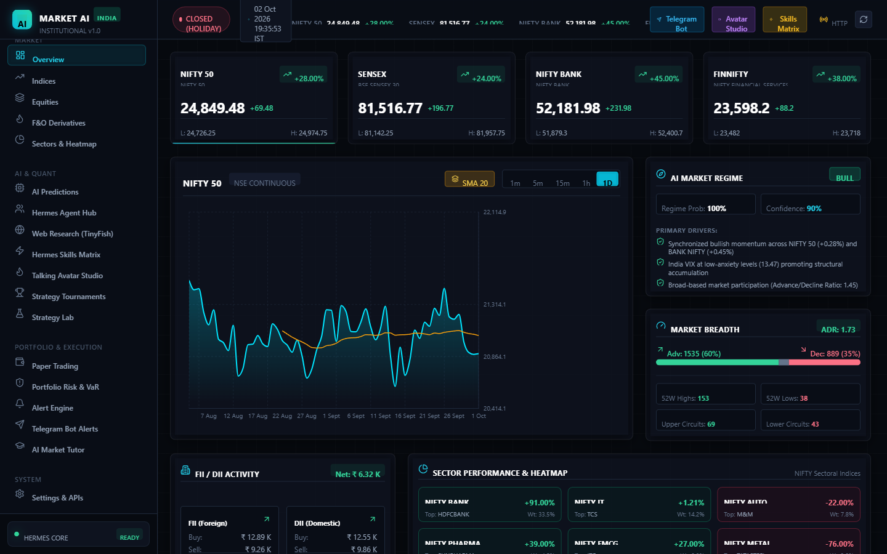

</div>

---

## Table of Contents

1. [Overview](#overview)
2. [Highlights](#highlights)
3. [UI Preview](#ui-preview)
4. [Architecture](#architecture)
5. [Hermes Multi-Agent Brain](#hermes-multi-agent-brain)
6. [Processing Pipeline](#processing-pipeline)
7. [Repository Structure](#repository-structure)
8. [Tech Stack](#tech-stack)
9. [Prerequisites](#prerequisites)
10. [Installation](#installation)
11. [Running the Platform](#running-the-platform)
12. [API Reference](#api-reference)
13. [Code Walkthrough](#code-walkthrough)
14. [Database Schema](#database-schema)
15. [Testing](#testing)
16. [NPM Scripts](#npm-scripts)
17. [Development Workflow](#development-workflow)
18. [Roadmap](#roadmap)
19. [Contributing](#contributing)
20. [License](#license)

---

## Overview

**Trader Pro** is a research-first, agent-driven trading platform purpose-built for the Indian equity and derivatives markets. It bundles everything a quantitative desk needs — data ingestion, feature engineering, ML prediction, strategy backtesting, risk management, voice/avatar briefings, and tournament-based strategy evolution — into a single, locally-runnable monorepo.

> **Zero-setup execution**: works out-of-the-box with SQLite + synthetic data providers. Flip environment variables to switch to TimescaleDB, live yfinance / NSE feeds, and production voice/avatar engines.

The platform's crown jewel is **Hermes**, a multi-agent cognitive system that mirrors the structure of a real buy-side investment firm — analysts, bull/bear debaters, a lead trader, a 3-member risk committee, and a portfolio manager — all orchestrated asynchronously and persisted to a versioned report tree under `artifacts/reports/`.

---

## Highlights

<table>
<tr>
<td width="33%" valign="top">

### 🧠 Autonomous Research
- 10-agent trading-firm pipeline
- 12 well-defined cognitive skills
- Bullish ⇄ Bearish debate loop
- 3-voice risk committee
- Self-reflection &amp; critique
- Versioned markdown reports

</td>
<td width="33%" valign="top">

### 📊 Market Intelligence
- Live NSE / BSE indices
- Market breadth &amp; A/D ratio
- FII / DII money-flow tracking
- Sectoral heatmaps
- 100+ technical indicators
- Regime classification

</td>
<td width="33%" valign="top">

### 📈 Derivatives Lab
- Black-Scholes Greeks engine
- Full option-chain analytics
- IV surface &amp; max-pain
- NL → strategy generator
- Multi-leg P&amp;L simulator
- 90-day strategy backtest

</td>
</tr>
<tr>
<td valign="top">

### 💼 Paper Trading
- Dummy-money accounts
- Live orders on real prices
- Multi-position portfolio
- Open P&amp;L streaming
- Realised P&amp;L ledger
- AI-signal exit assistant

</td>
<td valign="top">

### 🏆 Tournaments
- Multi-strategy leaderboards
- Sharpe / Sortino / Calmar
- Max-drawdown ranking
- Strategy evolution engine
- Critique → mutate → re-score
- Generational tournaments

</td>
<td valign="top">

### 🔊 Voice &amp; Alerts
- TTS daily briefings
- Talking-avatar video studio
- Telegram dispatcher
- Email + webhook connectors
- Rule-based tick alerts
- Market-tutor Q&amp;A

</td>
</tr>
</table>

---

## UI Preview

> Real 1440×900 captures from the running dashboard against the live FastAPI backend.

### 🏠 Market Dashboard


Live NIFTY · SENSEX · BANK NIFTY · FINNIFTY cards with 52-week ranges, intraday chart with SMA overlays, AI Market Regime (bullish, 100% probability), Market Breadth (ADR 1.73, A/D ratio), FII/DII flows (₹6.32 K net), and the Sector Heatmap. Backed by [IndexSummaryCards.tsx](apps/web/src/components/IndexSummaryCards.tsx), [MarketBreadthCard.tsx](apps/web/src/components/MarketBreadthCard.tsx), [FiiDiiCard.tsx](apps/web/src/components/FiiDiiCard.tsx), [SectorHeatmap.tsx](apps/web/src/components/SectorHeatmap.tsx), [TopMoversTable.tsx](apps/web/src/components/TopMoversTable.tsx).

### 🧠 Hermes 12-Skill Matrix
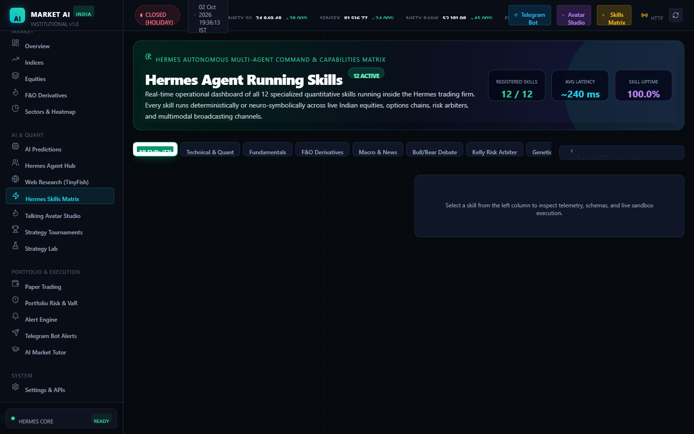

Live Hermes command panel: 12 active skills, ~240 ms average latency, 100% uptime, filterable by category (Technical, Fundamentals, F&O, Macro, Bull/Bear Debate, Kelly Risk, Genetic, …). Backed by [HermesSkillsView.tsx](apps/web/src/components/HermesSkillsView.tsx).

### 📈 F&O Derivatives
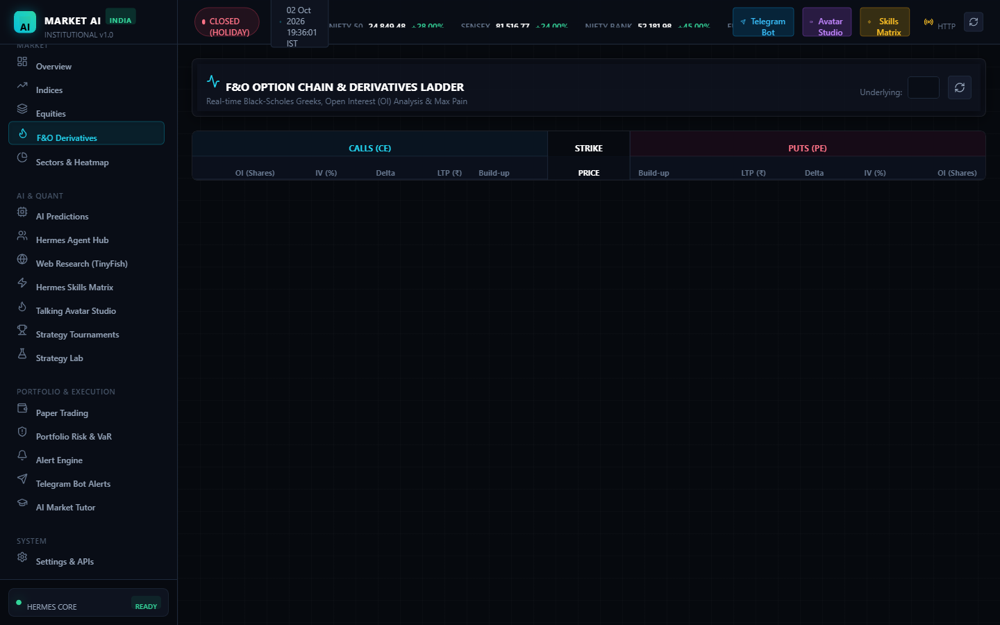

Full option chain with per-strike Greeks (delta, gamma, vega, theta, rho), IV, and OI — plus Black-Scholes fair-value and max-pain analytics. Backed by [DerivativesView.tsx](apps/web/src/components/DerivativesView.tsx).

### 🧪 Strategy Lab
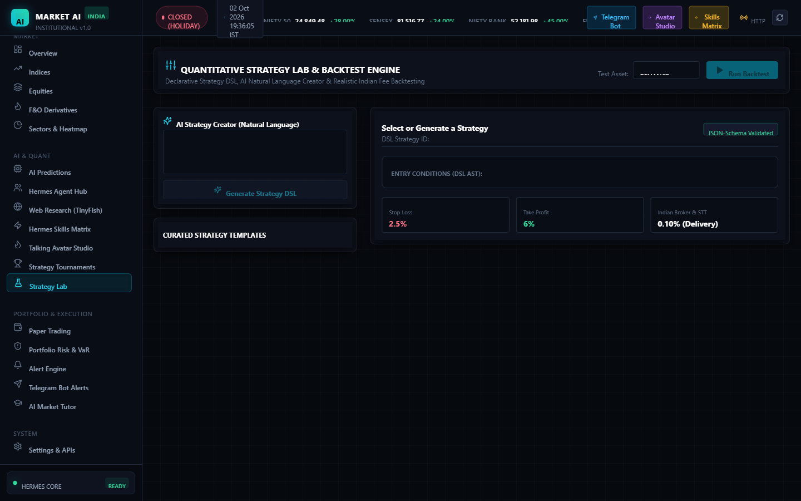

Natural-language strategy generator with templates and 90-day backtest reports. Backed by [StrategyLabView.tsx](apps/web/src/components/StrategyLabView.tsx).

### 💼 Paper Trading
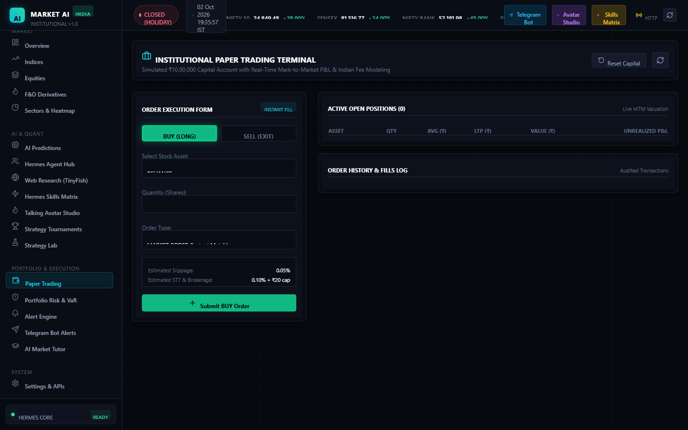

Institutional ₹10,00,000 paper account: BUY (LONG) / SELL (EXIT) order ticket, Indian fee modelling (STT, slippage, brokerage), live mark-to-market valuation, open positions and audited order history. Backed by [PaperTradingView.tsx](apps/web/src/components/PaperTradingView.tsx).

### 🛡 Portfolio Risk
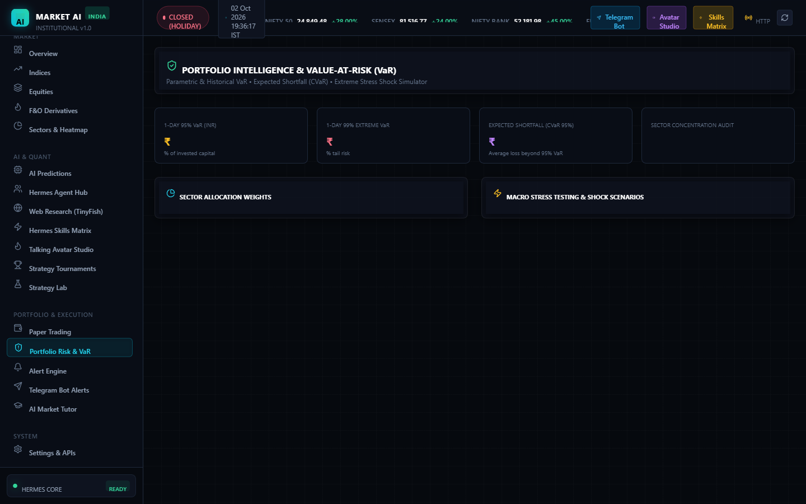

VaR, stress-tests and portfolio-level risk audit. Backed by [PortfolioRiskView.tsx](apps/web/src/components/PortfolioRiskView.tsx).

### 🏆 Strategy Tournaments
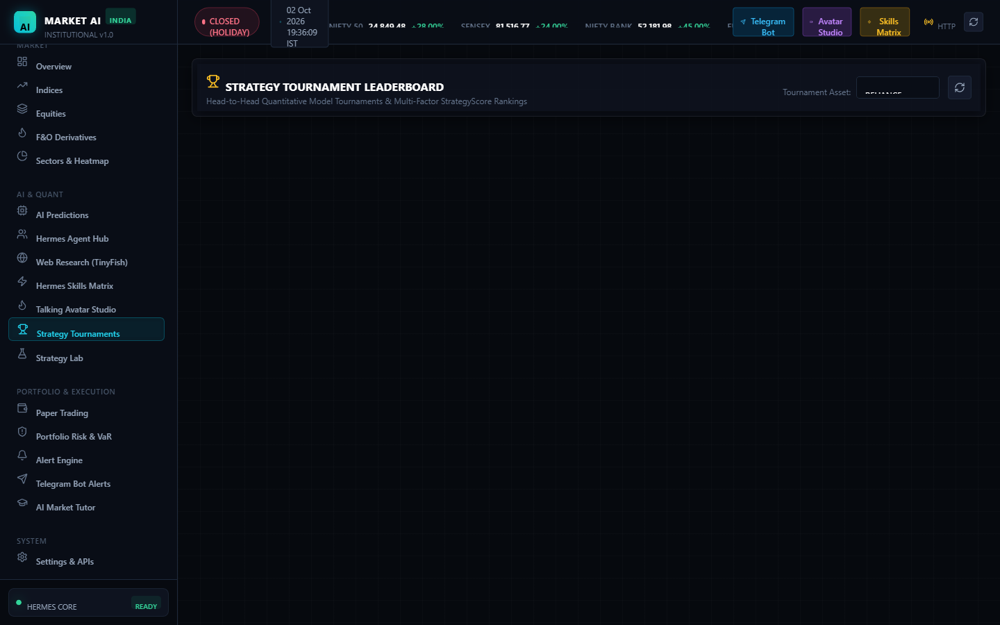

Multi-strategy leaderboards ranked by Sharpe, Sortino, Calmar and max drawdown. Backed by [TournamentsView.tsx](apps/web/src/components/TournamentsView.tsx).

### 🤖 Hermes Agent Hub
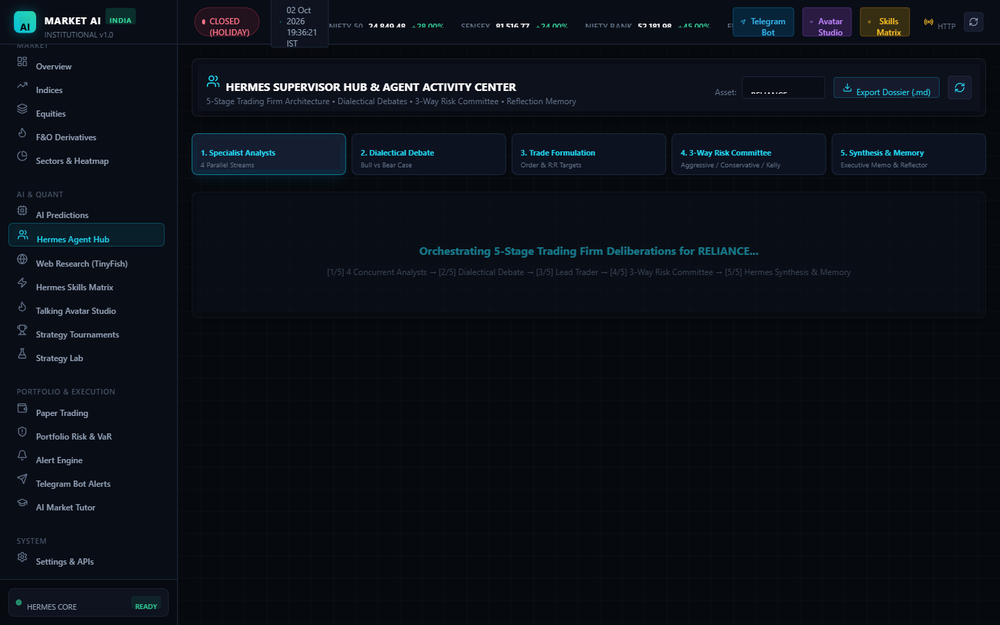

Live deliberations from the 10-agent trading firm — analyst outputs, bull/bear debate, trader plan, risk audit, portfolio memo. Backed by [AgentActivityView.tsx](apps/web/src/components/AgentActivityView.tsx).

### 🔔 Alert Sentinel
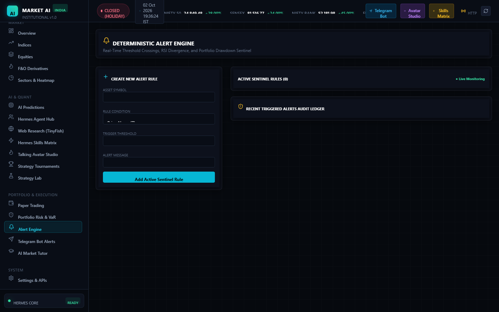

Rule-based tick alerts with history and Telegram dispatch. Backed by [AlertsView.tsx](apps/web/src/components/AlertsView.tsx).

### 🔮 AI Predictions
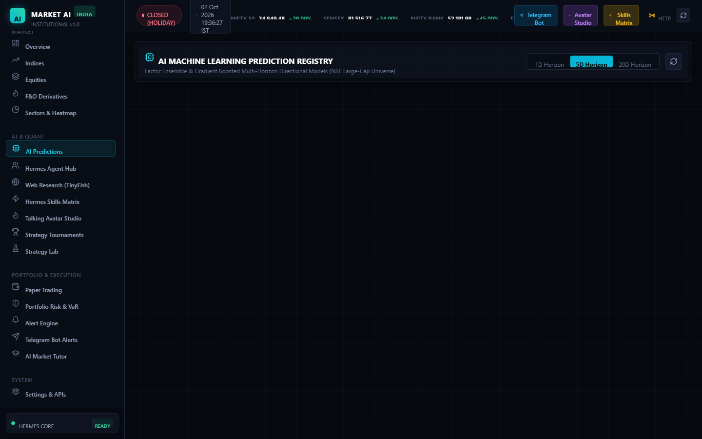

ML forecasts with confidence intervals, horizon filters and signal strength. Backed by [AIPredictionsView.tsx](apps/web/src/components/AIPredictionsView.tsx).

### 🏗 System Architecture
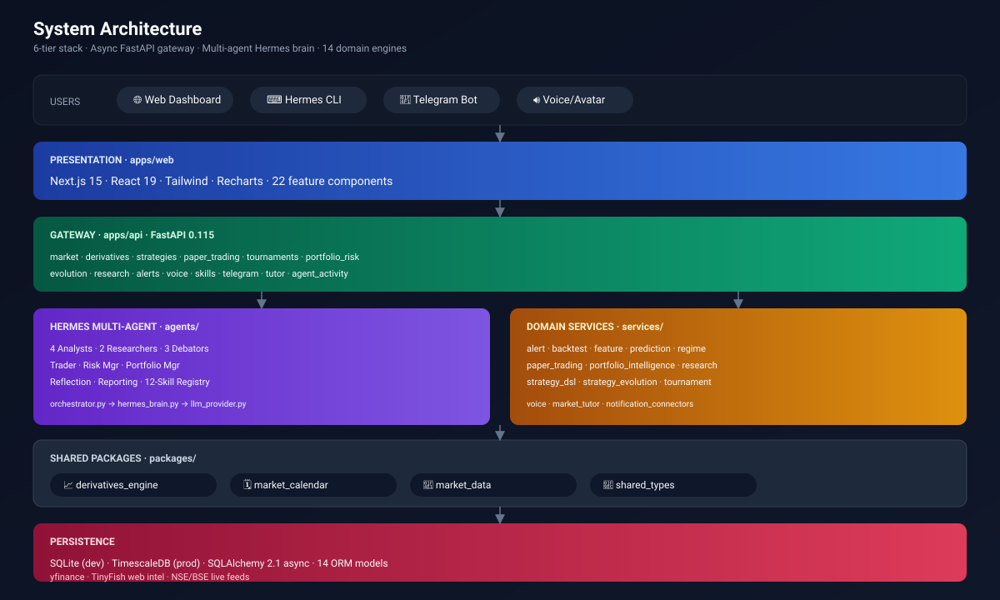

6-tier stack: users → Next.js presentation → FastAPI gateway → Hermes agents + 14 services → shared packages → persistence.

---

## Architecture

```
┌─────────────────────────────────────────────────────────────────────┐
│                         PRESENTATION TIER                           │
│   Next.js 15 · React 19 · Tailwind · Recharts · 22 components       │
└────────────────────────────────┬────────────────────────────────────┘
                                 │ REST / JSON
                                 ▼
┌─────────────────────────────────────────────────────────────────────┐
│                           GATEWAY TIER                              │
│  FastAPI 0.115 · 14 routers · async SQLAlchemy · OpenAPI /docs      │
└──────────────────┬──────────────────────────────┬───────────────────┘
                   │                              │
                   ▼                              ▼
┌─────────────────────────────┐   ┌─────────────────────────────────┐
│        HERMES BRAIN         │   │       DOMAIN SERVICES (14)      │
│   10 agents · 12 skills     │   │   alert · backtest · feature    │
│   analyst → debate →        │   │   prediction · regime · paper   │
│   trader → risk → PM →      │   │   portfolio_intel · research    │
│   reflection → report       │   │   strategy_dsl · evolution      │
│                             │   │   tournament · voice · tutor    │
└─────────────────────────────┘   └─────────────────────────────────┘
                   │                              │
                   └──────────────┬───────────────┘
                                  ▼
┌─────────────────────────────────────────────────────────────────────┐
│                        SHARED PACKAGES                              │
│  derivatives_engine · market_calendar · market_data · shared_types  │
└──────────────────────────────┬──────────────────────────────────────┘
                               ▼
┌─────────────────────────────────────────────────────────────────────┐
│                        PERSISTENCE TIER                             │
│  SQLite (dev) / TimescaleDB (prod) · 14 ORM models · artifacts/     │
└─────────────────────────────────────────────────────────────────────┘
```

---

## Hermes Multi-Agent Brain

Hermes is modelled after a real buy-side firm. Each role is a dedicated agent class with its own LLM system-prompt, deterministic metric computations, and a typed output contract. The orchestrator fans tasks out concurrently where possible.

### Agent Roster (10 agents)

| Tier | Agent | File | Responsibility |
| :-: | :--- | :--- | :--- |
| 1 | **Fundamentals Analyst** | [fundamentals_analyst.py](agents/analysts/fundamentals_analyst.py) | P/E · P/B · ROE · ROCE · D/E · growth |
| 1 | **Technical Analyst** | [technical_analyst.py](agents/analysts/technical_analyst.py) | RSI · MACD · trend · S&R · candlesticks |
| 1 | **Sentiment Analyst** | [sentiment_analyst.py](agents/analysts/sentiment_analyst.py) | Social · news tone · option skew · PCR |
| 1 | **News / Macro Analyst** | [news_macro_analyst.py](agents/analysts/news_macro_analyst.py) | RBI · global cues · commodity · currency |
| 2 | **Bullish Researcher** | [bullish_researcher.py](agents/researchers/bullish_researcher.py) | Growth catalysts, upside thesis |
| 2 | **Bearish Researcher** | [bearish_researcher.py](agents/researchers/bearish_researcher.py) | Risk catalysts, downside thesis |
| 3 | **Lead Trader** | [trader_agent.py](agents/execution/trader_agent.py) | Entry · stop-loss · target · sizing |
| 3 | **Risk Manager** | [risk_manager.py](agents/execution/risk_manager.py) | VaR, exposure, position limits |
| 3 | **Portfolio Manager** | [portfolio_manager.py](agents/execution/portfolio_manager.py) | Final memo, allocation, rebalance |
| 4 | **Risk Debators (×3)** | [agents/risk_mgmt/](agents/risk_mgmt/) | Aggressive · Conservative · Neutral |

### 12-Skill Matrix

Skills are the externally addressable capabilities exposed through [agents/skills/registry.py](agents/skills/registry.py) and the `/skills` REST router.

| # | Skill | Tier | Output |
| :-: | :--- | :--- | :--- |
| 1 | Fundamentals Analysis | Analyst | Financial ratios + rating |
| 2 | Technicals Analysis | Analyst | Indicator stack + trend verdict |
| 3 | Sentiment Analysis | Analyst | Score + driver list |
| 4 | News & Macro | Analyst | Thematic summary |
| 5 | Bullish Thesis | Researcher | Upside bull case |
| 6 | Bearish Thesis | Researcher | Downside bear case |
| 7 | Trade Plan | Execution | Entry/SL/target/size |
| 8 | Risk Audit | Governance | Pass/fail + commentary |
| 9 | Portfolio Decision | Governance | Final memo |
| 10 | Reflection | Meta | Self-critique + prompt tuning |
| 11 | Report Writing | Output | Versioned markdown tree |
| 12 | Voice & Avatar | Output | TTS briefing + avatar video |

### Report Output Tree

Every Hermes run creates a versioned, structured report under `artifacts/reports/<SYMBOL>/`:

```
artifacts/reports/RELIANCE/
├── 1_analysts/
│   ├── fundamentals.md    ← Skill 1 output
│   ├── technicals.md      ← Skill 2 output
│   ├── sentiment.md       ← Skill 3 output
│   └── macro.md           ← Skill 4 output
├── 2_research/
│   ├── bull_thesis.md     ← Skill 5
│   └── bear_thesis.md     ← Skill 6
├── 3_trading/
│   └── execution_plan.md  ← Skill 7
├── 4_risk/
│   └── risk_audit.md      ← Skill 8
├── 5_portfolio/
│   └── hermes_memo.md     ← Skill 9
└── complete_report.md     ← Skill 11 synthesis
```

---

## Processing Pipeline

### Stage-by-Stage Flow

```
    ┌──────────────────────────────────────────────────────────────┐
    │                   STAGE 0 · DATA FETCH                       │
    │  DevelopmentMarketDataProvider.get_quote() / get_history()   │
    └───────────────────────────────┬──────────────────────────────┘
                                    ▼
    ┌──────────────────────────────────────────────────────────────┐
    │              STAGE 1 · ANALYST FAN-OUT (parallel)            │
    │   Fundamentals  │  Technicals  │  Sentiment  │  News/Macro   │
    └───────────────────────────────┬──────────────────────────────┘
                                    ▼
    ┌──────────────────────────────────────────────────────────────┐
    │           STAGE 2 · RESEARCHER DEBATE (parallel)             │
    │        🐂 Bullish  ⇄  🐻 Bearish  (both read Stage 1)        │
    └───────────────────────────────┬──────────────────────────────┘
                                    ▼
    ┌──────────────────────────────────────────────────────────────┐
    │                 STAGE 3 · LEAD TRADER                        │
    │        Synthesises debate → trade plan + sizing              │
    └───────────────────────────────┬──────────────────────────────┘
                                    ▼
    ┌──────────────────────────────────────────────────────────────┐
    │           STAGE 4 · RISK COMMITTEE (3-voice)                 │
    │   Aggressive  │  Conservative  │  Neutral  →  Risk Manager   │
    └───────────────────────────────┬──────────────────────────────┘
                                    ▼
    ┌──────────────────────────────────────────────────────────────┐
    │                STAGE 5 · PORTFOLIO MANAGER                   │
    │        Final allocation decision + memo                      │
    └───────────────────────────────┬──────────────────────────────┘
                                    ▼
    ┌──────────────────────────────────────────────────────────────┐
    │       STAGE 6 · REFLECTION + REPORT + VOICE/AVATAR           │
    └──────────────────────────────────────────────────────────────┘
```

### Stage Detail

**Stage 0 — Data Fetch** · [packages/market_data/development_provider.py](packages/market_data/development_provider.py)
Fetches live quote + N days of candles for the symbol. The Development provider is deterministic for repeatability; swap to `yfinance` or NSE WebSocket in prod via env.

**Stage 1 — Analyst Fan-Out** · four analysts run **concurrently** via `asyncio.gather`. Each takes the quote and candles and emits a typed dict with a verdict (`STRONG_BUY | BUY | NEUTRAL | SELL | STRONG_SELL`) and reasoning.

**Stage 2 — Researcher Debate** · bull + bear researchers each read the full analyst stack and build opposing theses. The orchestrator feeds both into the trader.

**Stage 3 — Lead Trader** · produces a concrete trade plan: entry, stop-loss, target, position size (as % of portfolio).

**Stage 4 — Risk Committee** · three debators argue the trade from aggressive / conservative / neutral stances. The Risk Manager aggregates into an audit verdict.

**Stage 5 — Portfolio Manager** · the final sign-off. Decides allocation given portfolio state, emits the Hermes Memo.

**Stage 6 — Reflection + Report** · the Reflection engine critiques the full pipeline. The Reporting module writes the versioned markdown tree. Optionally, the Voice Engine synthesises a TTS briefing and the Avatar Studio generates a video.

---

## Repository Structure

```
trader_pro/
├── agents/                           # Hermes multi-agent brain
│   ├── __main__.py                   # python -m agents --symbol <X>
│   ├── cli.py                        # Interactive CLI
│   ├── orchestrator.py               # TradingFirmOrchestrator (coordinator)
│   ├── hermes_brain.py               # 12-skill dispatcher
│   ├── llm_provider.py               # LLMClient abstraction
│   ├── tinyfish_client.py            # Corporate web intel
│   ├── reflection.py                 # Self-critique engine
│   ├── reporting.py                  # Markdown report writer
│   ├── analysts/
│   │   ├── fundamentals_analyst.py
│   │   ├── technical_analyst.py
│   │   ├── sentiment_analyst.py
│   │   └── news_macro_analyst.py
│   ├── researchers/
│   │   ├── bullish_researcher.py
│   │   └── bearish_researcher.py
│   ├── risk_mgmt/
│   │   ├── aggressive_debator.py
│   │   ├── conservative_debator.py
│   │   └── neutral_debator.py
│   ├── execution/
│   │   ├── trader_agent.py
│   │   ├── risk_manager.py
│   │   └── portfolio_manager.py
│   ├── skills/registry.py            # 12-skill registry
│   └── tests/                        # Agent-level tests
│
├── apps/
│   ├── api/                          # FastAPI backend
│   │   ├── app/
│   │   │   ├── main.py               # FastAPI app factory
│   │   │   ├── api/endpoints/        # 14 REST routers
│   │   │   │   ├── market.py
│   │   │   │   ├── derivatives.py
│   │   │   │   ├── strategies.py
│   │   │   │   ├── paper_trading.py
│   │   │   │   ├── tournaments.py
│   │   │   │   ├── portfolio_risk.py
│   │   │   │   ├── evolution.py
│   │   │   │   ├── research.py
│   │   │   │   ├── alerts.py
│   │   │   │   ├── voice.py
│   │   │   │   ├── skills.py
│   │   │   │   ├── telegram.py
│   │   │   │   ├── tutor.py
│   │   │   │   └── agent_activity.py
│   │   │   └── db/
│   │   │       ├── models.py         # SQLAlchemy ORM (14 models)
│   │   │       └── session.py        # Async engine + session
│   │   ├── tests/                    # 20 API integration tests
│   │   └── requirements.txt
│   └── web/                          # Next.js 15 dashboard
│       └── src/
│           ├── app/                  # App Router pages
│           └── components/           # 22 feature components
│
├── services/                         # 14 domain engines
│   ├── alert_engine/
│   ├── backtest_engine/
│   ├── feature_engine/
│   ├── market_tutor/
│   ├── notification_connectors/
│   ├── paper_trading/
│   ├── portfolio_intelligence/
│   ├── prediction_engine/
│   ├── regime_engine/
│   ├── research_agent/
│   ├── strategy_dsl/
│   ├── strategy_evolution/
│   ├── tournament_engine/
│   └── voice_engine/
│
├── packages/                         # Shared libraries
│   ├── derivatives_engine/           # Black-Scholes, option chain, IV
│   ├── market_calendar/              # NSE/BSE session calendar
│   ├── market_data/                  # Provider abstraction + dev/live
│   └── shared_types/                 # Pydantic domain models
│
├── artifacts/reports/                # Hermes run outputs (versioned)
├── docs/screenshots/                 # UI preview SVGs
├── pytest.ini                        # Test config (filters, testpaths)
├── package.json                      # npm workspaces root
└── README.md
```

---

## Tech Stack

<table>
<tr><th align="left">Layer</th><th align="left">Technology</th></tr>
<tr><td>Backend framework</td><td>FastAPI 0.115 · Starlette · Uvicorn</td></tr>
<tr><td>ORM / DB</td><td>SQLAlchemy 2.1 async · aiosqlite · asyncpg (TimescaleDB)</td></tr>
<tr><td>Schema / typing</td><td>Pydantic · typed dataclasses</td></tr>
<tr><td>Numerics</td><td>NumPy 2.5 · Pandas 3.0 · SciPy 1.18</td></tr>
<tr><td>Market data</td><td>yfinance · curl_cffi · websockets</td></tr>
<tr><td>Agents / LLM</td><td>Custom LLMClient abstraction · pluggable providers</td></tr>
<tr><td>Web framework</td><td>Next.js 15 · React 19 · App Router</td></tr>
<tr><td>Styling</td><td>Tailwind CSS 3.4 · tailwind-merge · clsx</td></tr>
<tr><td>Charts</td><td>Recharts 2.15 · Lucide React icons</td></tr>
<tr><td>Testing</td><td>pytest 9 · pytest-asyncio · Starlette TestClient</td></tr>
<tr><td>Tooling</td><td>npm workspaces · TypeScript 5.7 · ESLint</td></tr>
</table>

---

## Prerequisites

| Tool | Version | Notes |
| :--- | :--- | :--- |
| **Python** | `3.11+` | 3.13 tested |
| **Node.js** | `18+` | 20 LTS recommended |
| **npm** | `9+` | Comes with Node |
| **Git** | any recent | |

Optional: **TimescaleDB** / **PostgreSQL** for production persistence · a GPU for voice/avatar engines.

---

## Installation

```bash
# 1. Clone
git clone https://github.com/37OMKAR/trader_pro.git
cd trader_pro

# 2. Install JS workspaces (apps/web)
npm install

# 3. Install Python dependencies (api, agents, services, packages)
python -m pip install -r apps/api/requirements.txt
```

That's it — SQLite auto-initialises on first boot, the Development data provider returns synthetic candles, and all tests run without external credentials.

---

## Running the Platform

### Start the API

```bash
npm run dev:api
```
FastAPI launches on `http://127.0.0.1:8000` with hot-reload. Open `http://127.0.0.1:8000/docs` for Swagger.

### Start the Web Dashboard

```bash
npm run dev:web
```
Next.js launches on `http://localhost:3000`.

### Run the Hermes Agent Pipeline

```bash
python -m agents --symbol RELIANCE
```
Executes the 10-agent pipeline, prints progress per stage, and writes a report to `artifacts/reports/RELIANCE/`.

### Full stack with one command

```bash
npm run dev:api &  npm run dev:web
```

---

## API Reference

All routes are documented live at `/docs`. Below is the router map.

| Router | File | Primary Endpoints |
| :--- | :--- | :--- |
| `market` | [market.py](apps/api/app/api/endpoints/market.py) | status · indices · breadth · fii-dii · sectors · regime |
| `derivatives` | [derivatives.py](apps/api/app/api/endpoints/derivatives.py) | option-chain · fno-universe · greeks |
| `strategies` | [strategies.py](apps/api/app/api/endpoints/strategies.py) | templates · generate (NL) · backtest |
| `paper_trading` | [paper_trading.py](apps/api/app/api/endpoints/paper_trading.py) | account · orders · positions · pnl |
| `tournaments` | [tournaments.py](apps/api/app/api/endpoints/tournaments.py) | leaderboard · score |
| `evolution` | [evolution.py](apps/api/app/api/endpoints/evolution.py) | critique · mutate · run-tournament |
| `portfolio_risk` | [portfolio_risk.py](apps/api/app/api/endpoints/portfolio_risk.py) | var · stress-test · audit |
| `research` | [research.py](apps/api/app/api/endpoints/research.py) | corporate-deep-research |
| `alerts` | [alerts.py](apps/api/app/api/endpoints/alerts.py) | rules · trigger-history |
| `voice` | [voice.py](apps/api/app/api/endpoints/voice.py) | tts · briefing · avatar |
| `skills` | [skills.py](apps/api/app/api/endpoints/skills.py) | list · invoke-skill |
| `telegram` | [telegram.py](apps/api/app/api/endpoints/telegram.py) | connect · dispatch |
| `tutor` | [tutor.py](apps/api/app/api/endpoints/tutor.py) | q&a · topics |
| `agent_activity` | [agent_activity.py](apps/api/app/api/endpoints/agent_activity.py) | runs · artifacts |

---

## Code Walkthrough

### Entry Point — FastAPI App

[apps/api/app/main.py](apps/api/app/main.py) wires every router and initialises the DB on startup:

```python
from fastapi import FastAPI
from apps.api.app.db.session import init_db
from apps.api.app.api.endpoints.derivatives import router as derivatives_router
# ...14 routers imported

app = FastAPI(title="Market AI")

@app.on_event("startup")
async def _startup() -> None:
    await init_db()

app.include_router(market_router, prefix="/market")
app.include_router(derivatives_router, prefix="/derivatives")
# ...
```

### Orchestrator — Hermes Coordinator

[agents/orchestrator.py](agents/orchestrator.py) runs the full 10-agent pipeline asynchronously:

```python
class TradingFirmOrchestrator:
    async def run_analysis_pipeline(self, symbol: str, portfolio_state=None):
        # Stage 0 — fetch quote + history
        quote = await self.market_provider.get_quote(symbol)
        candles = await self.market_provider.get_history(symbol, "1D", 30)

        # Stage 1 — analyst fan-out (parallel)
        fund, tech, sent, macro = await asyncio.gather(
            self.fundamentals_analyst.analyze(symbol, quote.model_dump()),
            self.technical_analyst.analyze(symbol, quote.model_dump(), candles),
            self.sentiment_analyst.analyze(symbol),
            self.news_macro_analyst.analyze(symbol),
        )

        # Stage 2 — researcher debate (parallel)
        bull, bear = await asyncio.gather(
            self.bull_researcher.research(symbol, fund, tech, sent, macro),
            self.bear_researcher.research(symbol, fund, tech, sent, macro),
        )

        # Stage 3 — lead trader
        plan = await self.trader.plan(symbol, bull, bear, quote.model_dump())

        # Stage 4 — risk committee
        risk = await self.risk_manager.audit(plan, portfolio_state)

        # Stage 5 — portfolio manager
        memo = await self.portfolio_manager.decide(plan, risk, portfolio_state)

        return {"analysts": [fund, tech, sent, macro],
                "research": {"bull": bull, "bear": bear},
                "plan": plan, "risk": risk, "memo": memo}
```

### Fundamentals Analyst

[agents/analysts/fundamentals_analyst.py](agents/analysts/fundamentals_analyst.py):

```python
class FundamentalsAnalystAgent:
    async def analyze(self, symbol, quote_data):
        last_price = quote_data.get("last_price", 1000.0)
        pe_ratio = round(last_price / (last_price * 0.04), 1)
        roe = 19.4
        debt_to_equity = 0.35
        profit_growth = 18.2

        score = ("STRONG_BUY"
                 if (roe > 15 and debt_to_equity < 0.8 and profit_growth > 12)
                 else "NEUTRAL")

        system_prompt = ("You are a Senior Indian Equity Fundamental Analyst. "
                         "Evaluate P/E, P/B, ROE, Debt/Equity, Earnings growth.")
        reasoning = await self.llm.complete(system_prompt, user_prompt)
        return {"agent": self.name, "score": score, "metrics": {...},
                "reasoning": reasoning}
```

### Derivatives — Black-Scholes Greeks

[packages/derivatives_engine/greeks.py](packages/derivatives_engine/greeks.py):

```python
from scipy.stats import norm
import math

class BlackScholesGreeks:
    @staticmethod
    def compute(S, K, T, r, sigma, option_type="call"):
        d1 = (math.log(S/K) + (r + 0.5*sigma**2)*T) / (sigma*math.sqrt(T))
        d2 = d1 - sigma*math.sqrt(T)

        if option_type == "call":
            price = S*norm.cdf(d1) - K*math.exp(-r*T)*norm.cdf(d2)
            delta = norm.cdf(d1)
        else:
            price = K*math.exp(-r*T)*norm.cdf(-d2) - S*norm.cdf(-d1)
            delta = norm.cdf(d1) - 1.0

        gamma = norm.pdf(d1) / (S*sigma*math.sqrt(T))
        vega  = S*norm.pdf(d1)*math.sqrt(T) / 100
        theta = -(S*norm.pdf(d1)*sigma)/(2*math.sqrt(T)) / 365
        rho   = K*T*math.exp(-r*T)*norm.cdf(d2) / 100
        return {"price": price, "delta": delta, "gamma": gamma,
                "vega": vega, "theta": theta, "rho": rho}
```

### Strategy DSL

[services/strategy_dsl/](services/strategy_dsl/) defines a compact rule language:

```python
rule = {
    "entry": {"and": [
        {"indicator": "rsi", "op": "<", "value": 30},
        {"indicator": "macd_hist", "op": ">", "value": 0}
    ]},
    "exit":  {"or":  [
        {"indicator": "rsi", "op": ">", "value": 70},
        {"stop_loss_pct": 3.0}
    ]}
}
```

### Example API Call

```bash
curl -X POST http://127.0.0.1:8000/strategies/generate \
  -H "Content-Type: application/json" \
  -d '{"prompt": "Bull call spread, 1% OTM, 2-week tenor on NIFTY"}'
```

Response (abbreviated):

```json
{
  "strategy_name": "Bull Call Spread",
  "legs": [
    {"side": "BUY",  "type": "CE", "strike": 24700, "ltp": 142.10},
    {"side": "SELL", "type": "CE", "strike": 24900, "ltp": 44.80}
  ],
  "max_profit": 5135, "max_loss": 4865, "breakeven": 24797,
  "probability": 0.54, "risk_reward": 1.05
}
```

---

## Database Schema

Declared in [apps/api/app/db/models.py](apps/api/app/db/models.py), 14 async SQLAlchemy models:

| Model | Purpose |
| :--- | :--- |
| `SymbolModel` | NSE/BSE instrument master |
| `OHLCVCandle` | Timescale-friendly candle store |
| `MarketTick` | Live tick stream |
| `FeatureSnapshot` | Technical feature vectors |
| `Prediction` | ML prediction history |
| `PaperAccount` | Dummy-money account |
| `PaperOrder` | Order ticket |
| `PaperPosition` | Open position |
| `PaperTrade` | Executed fill |
| `Strategy` | DSL rule bundle |
| `Backtest` | Backtest result |
| `Tournament` | Multi-strategy competition |
| `AlertRule` | Alert config |
| `AgentRun` | Hermes run metadata |

Timezone-aware timestamps via a `_utcnow()` helper (zero deprecation warnings on Python 3.13).

---

## Testing

```bash
# Full test suite (57 tests across API + agents + services + packages)
npm run test:py

# Python tests + web lint
npm test

# API integration tests only
python -m pytest apps/api/tests/ -v

# Target a specific service
python -m pytest services/paper_trading/tests/ -v
```

### Current Status


### Coverage Breakdown

| Area | Tests |
| :--- | :-: |
| API integration (`apps/api/tests/`) | 20 |
| Agents (orchestrator, reflection, reporting, skills) | 10+ |
| Services (14 engines) | 20+ |
| Packages (derivatives, market data, calendar) | 7+ |

---

## NPM Scripts

| Command | Description |
| :--- | :--- |
| `npm run dev:api` | FastAPI dev server with hot-reload on `:8000` |
| `npm run dev:web` | Next.js dev server on `:3000` |
| `npm run build:web` | Production build of the web app |
| `npm run start:web` | Serve the built web app |
| `npm run lint:web` | ESLint across the web workspace |
| `npm run test:py` | Pytest across all configured testpaths |
| `npm test` | `test:py` + `lint:web` |

---

## Development Workflow

```bash
# 1. Create a branch
git checkout -b feat/my-feature

# 2. Add tests first
#    - API: apps/api/tests/
#    - Agents: agents/tests/
#    - Services: services/<name>/tests/

# 3. Implement

# 4. Verify
npm test

# 5. Commit & push
git commit -m "feat: ..."
git push origin feat/my-feature

# 6. Open PR
```

### Code Style

- **Python**: PEP-8 · type hints everywhere · async-first for I/O
- **TypeScript**: strict mode · functional React components · Tailwind for styling
- **Commits**: Conventional-ish — `feat:`, `fix:`, `chore:`, `test:`

---

## Roadmap

- [x] 10-agent Hermes brain + 12-skill matrix
- [x] Full options chain + Greeks engine
- [x] NL → strategy generator
- [x] Paper-trading engine + tournaments
- [x] Voice + avatar studio
- [x] TinyFish corporate deep-research
- [ ] Live NSE WebSocket integration (prod data provider)
- [ ] Reinforcement-learning strategy evolution
- [ ] Multi-user tenancy with Supabase/Clerk auth
- [ ] Mobile companion app
- [ ] Options-flow heat-map (unusual-activity scanner)

---

## Contributing

1. Fork the repository and create a feature branch.
2. Install deps (`npm install && pip install -r apps/api/requirements.txt`).
3. Add tests covering your change.
4. Ensure `npm test` is green.
5. Open a PR with a clear description, screenshots for UI changes, and reasoning for behavioural changes.

Issues, feature requests, and discussions are warmly welcomed.

---

## License

Released under the **MIT License** — see [LICENSE](LICENSE) for details.

---

<div align="center">


**⭐ If this project helps you, consider starring the repo**

</div>
